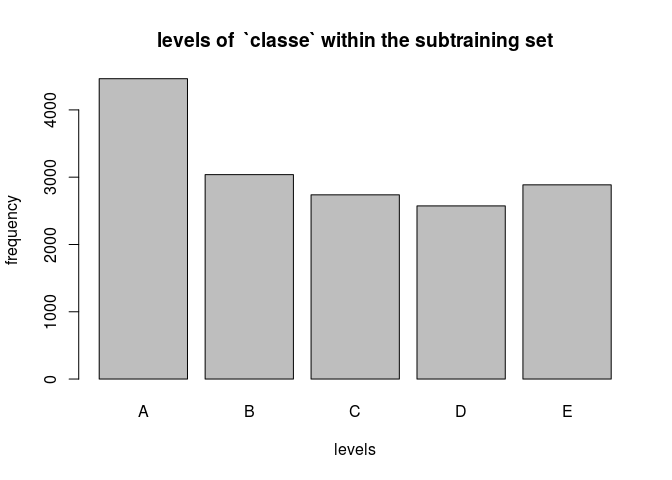

Introduction
------------

Using devices such as Jawbone Up, Nike FuelBand, and Fitbit it is now possible to collect a large amount of data about personal activity relatively inexpensively. These type of devices are part of the quantified self movement – a group of enthusiasts who take measurements about themselves regularly to improve their health, to find patterns in their behavior, or because they are tech geeks. One thing that people regularly do is quantify how much of a particular activity they do, but they rarely quantify how well they do it. In this project, your goal will be to use data from accelerometers on the belt, forearm, arm, and dumbell of 6 participants. They were asked to perform barbell lifts correctly and incorrectly in 5 different ways.

``` r
library(caret)
```

    ## Loading required package: lattice

    ## Loading required package: ggplot2

``` r
library(rpart)
library(dplyr)
```

    ## 
    ## Attaching package: 'dplyr'

    ## The following objects are masked from 'package:stats':
    ## 
    ##     filter, lag

    ## The following objects are masked from 'package:base':
    ## 
    ##     intersect, setdiff, setequal, union

``` r
set.seed(1)
training <- read.csv("pml-training.csv", na.strings=c("", "NA", "#DIV/0!"), row.names = 1)
testing <- read.csv("pml-testing.csv", na.strings=c("", "NA", "#DIV/0!"), row.names = 1)
training <- tbl_df(training)
testing <- tbl_df(testing)
```

The original file contains 159 columns with over 19000 rows. We will remove columns with missing values:

``` r
training <- training[,colSums(is.na(training)) == 0]
testing <- testing[,colSums(is.na(testing)) == 0]
```

Also we will remove unnecessary columns such as the first 6 columns:

``` r
training <- training[,-c(1:6)]
testing <- testing[,-c(1:6)]
dim(training)
```

    ## [1] 19622    53

``` r
dim(testing)
```

    ## [1] 20 53

We split the training set into subtraining and subtesting sets in order to allow cross-validation:

``` r
index <- createDataPartition(y=training$classe, p=0.8, list=FALSE)
trainingData <- training[index, ]
testingData <- training[-index, ]
```

The `classe` variable is a factor variable with 5 levels, A to E all of which occur in the same order of magnitude, as the following plot shows:

``` r
plot(trainingData$classe, main="levels of  `classe` within the subtraining set", xlab="levels", ylab="frequency")
```



Model selection
===============

We try two different models, one based on decision trees, the other one random forest.

Decision trees
--------------

Our first model is by using decision trees:

``` r
model1 <- rpart(classe ~ ., data=trainingData, method="class")
prediction1 <- predict(model1, testingData, type="class")
confusionMatrix(prediction1, testingData$classe)
```

    ## Confusion Matrix and Statistics
    ## 
    ##           Reference
    ## Prediction   A   B   C   D   E
    ##          A 985 109  15  49  13
    ##          B  38 454  55  50  64
    ##          C  27  78 553 106  83
    ##          D  42  44  46 383  41
    ##          E  24  74  15  55 520
    ## 
    ## Overall Statistics
    ##                                           
    ##                Accuracy : 0.738           
    ##                  95% CI : (0.7239, 0.7517)
    ##     No Information Rate : 0.2845          
    ##     P-Value [Acc > NIR] : < 2.2e-16       
    ##                                           
    ##                   Kappa : 0.668           
    ##  Mcnemar's Test P-Value : < 2.2e-16       
    ## 
    ## Statistics by Class:
    ## 
    ##                      Class: A Class: B Class: C Class: D Class: E
    ## Sensitivity            0.8826   0.5982   0.8085  0.59565   0.7212
    ## Specificity            0.9337   0.9346   0.9092  0.94726   0.9475
    ## Pos Pred Value         0.8412   0.6868   0.6529  0.68885   0.7558
    ## Neg Pred Value         0.9524   0.9065   0.9574  0.92278   0.9379
    ## Prevalence             0.2845   0.1935   0.1744  0.16391   0.1838
    ## Detection Rate         0.2511   0.1157   0.1410  0.09763   0.1326
    ## Detection Prevalence   0.2985   0.1685   0.2159  0.14173   0.1754
    ## Balanced Accuracy      0.9082   0.7664   0.8589  0.77145   0.8344

The accuracy of the decision tree method is at **74 %** which is very low.

Random Forest
-------------

Next, we try the random forest algorithm:

``` r
#model2 <- train(classe ~ ., data=trainingData, method="rf")  # takes forever
model2 <- train(classe ~ ., data=trainingData, method="rf", trControl=trainControl(method="none"), tuneGrid=data.frame(mtry=7)) # note by Mauricio Collaca on Coursera forum
#model2 <- randomForest(classe ~ ., data=trainingData) # alternative method
```

The in sample error rate is given by:

``` r
prediction2 <- predict(model2, trainingData)
confusionMatrix(prediction2, trainingData$classe)
```

    ## Confusion Matrix and Statistics
    ## 
    ##           Reference
    ## Prediction    A    B    C    D    E
    ##          A 4464    0    0    0    0
    ##          B    0 3038    0    0    0
    ##          C    0    0 2738    0    0
    ##          D    0    0    0 2573    0
    ##          E    0    0    0    0 2886
    ## 
    ## Overall Statistics
    ##                                      
    ##                Accuracy : 1          
    ##                  95% CI : (0.9998, 1)
    ##     No Information Rate : 0.2843     
    ##     P-Value [Acc > NIR] : < 2.2e-16  
    ##                                      
    ##                   Kappa : 1          
    ##  Mcnemar's Test P-Value : NA         
    ## 
    ## Statistics by Class:
    ## 
    ##                      Class: A Class: B Class: C Class: D Class: E
    ## Sensitivity            1.0000   1.0000   1.0000   1.0000   1.0000
    ## Specificity            1.0000   1.0000   1.0000   1.0000   1.0000
    ## Pos Pred Value         1.0000   1.0000   1.0000   1.0000   1.0000
    ## Neg Pred Value         1.0000   1.0000   1.0000   1.0000   1.0000
    ## Prevalence             0.2843   0.1935   0.1744   0.1639   0.1838
    ## Detection Rate         0.2843   0.1935   0.1744   0.1639   0.1838
    ## Detection Prevalence   0.2843   0.1935   0.1744   0.1639   0.1838
    ## Balanced Accuracy      1.0000   1.0000   1.0000   1.0000   1.0000

which is clear since we used the same data set. The out-of-sample error rate must be less:

``` r
prediction2 <- predict(model2, testingData)
confusionMatrix(prediction2, testingData$classe)
```

    ## Confusion Matrix and Statistics
    ## 
    ##           Reference
    ## Prediction    A    B    C    D    E
    ##          A 1114    2    0    0    0
    ##          B    1  756    4    0    0
    ##          C    0    1  679    7    0
    ##          D    0    0    1  635    1
    ##          E    1    0    0    1  720
    ## 
    ## Overall Statistics
    ##                                           
    ##                Accuracy : 0.9952          
    ##                  95% CI : (0.9924, 0.9971)
    ##     No Information Rate : 0.2845          
    ##     P-Value [Acc > NIR] : < 2.2e-16       
    ##                                           
    ##                   Kappa : 0.9939          
    ##  Mcnemar's Test P-Value : NA              
    ## 
    ## Statistics by Class:
    ## 
    ##                      Class: A Class: B Class: C Class: D Class: E
    ## Sensitivity            0.9982   0.9960   0.9927   0.9876   0.9986
    ## Specificity            0.9993   0.9984   0.9975   0.9994   0.9994
    ## Pos Pred Value         0.9982   0.9934   0.9884   0.9969   0.9972
    ## Neg Pred Value         0.9993   0.9991   0.9985   0.9976   0.9997
    ## Prevalence             0.2845   0.1935   0.1744   0.1639   0.1838
    ## Detection Rate         0.2840   0.1927   0.1731   0.1619   0.1835
    ## Detection Prevalence   0.2845   0.1940   0.1751   0.1624   0.1840
    ## Balanced Accuracy      0.9987   0.9972   0.9951   0.9935   0.9990

A value of over **99.5%** of accuracy is very good. We will use this model to predict our 20 test cases:

``` r
prediction3 <- predict(model2, testing)
prediction3
```

    ##  [1] B A B A A E D B A A B C B A E E A B B B
    ## Levels: A B C D E

All cases are predicted correctly.
